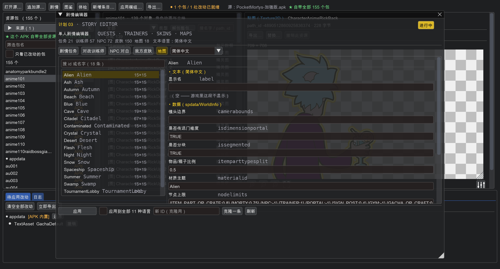
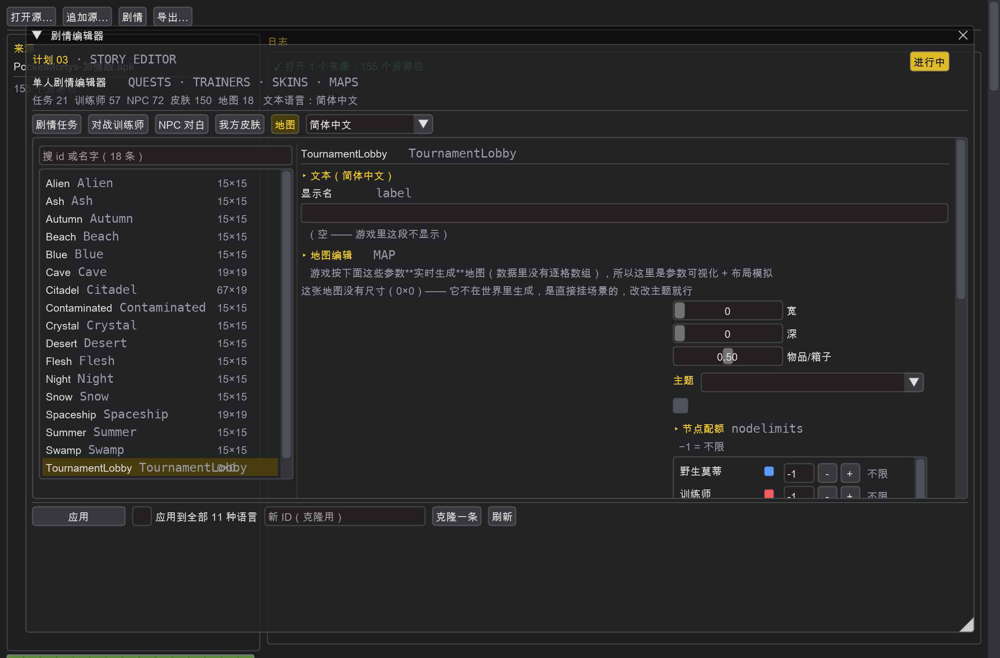
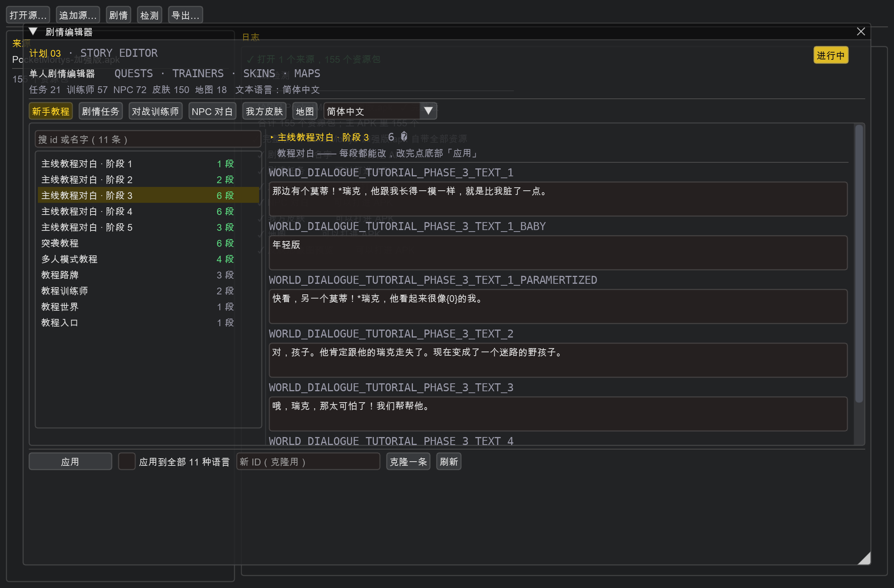
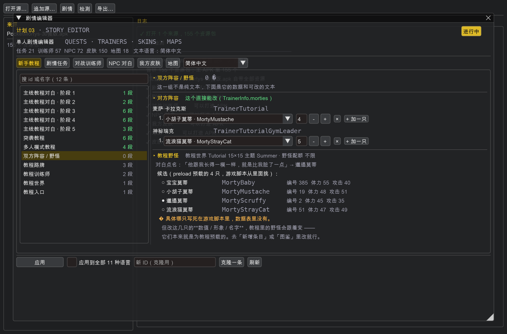
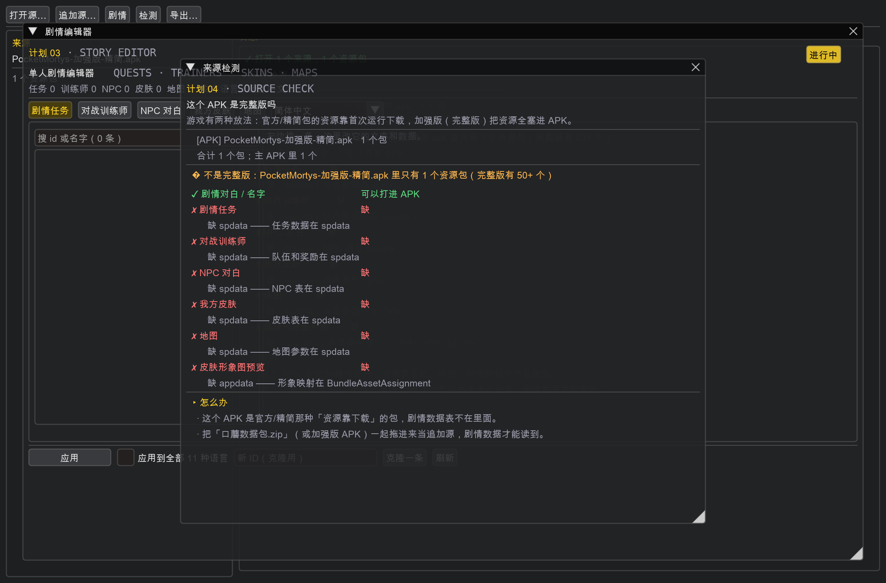

# 口蘑剧情工坊

Pocket Mortys **单人剧情**工坊 —— 改任务对白、对战训练师（含出场队伍）、
我方皮肤、地图、新手教程。

> 从 [pm-modkit](https://github.com/b6x2yqyvsr-dotcom/pm-modkit) 里**独立出来**的。
> 它不依赖 pm-modkit，自己带着需要的那几个内核模块（`pm_storykit/`）。


## 能改什么

| 板块 | 内容 |
|---|---|
| **新手教程** | 主线教程对白（5 个阶段 18 段）+ 突袭教程 + 多人模式教程 + 教程路牌 / 训练师 / 世界 / 入口 |
| **剧情任务** | 任务名 / 给予者 / 描述 / 进行中对白 / 交不齐时的 / 完成时 / 交付后 —— **7 段全可改**，外加徽章需求、需要的物品、给予者形象 |
| **对战训练师** | 3 段战前对白 + 战后对白，**出场队伍编辑器**（换一只莫蒂就是换对方形象，等级可调） |
| **NPC 对白** | 72 个 NPC 的名字和对白 |
| **我方皮肤** | 150 个玩家形象，带**形象图预览**，可改显示名/形象资产/分类/价格/货币/议会等级需求 |
| **地图** | **图形化编辑**：网格画布 + 尺寸滑条 + 主题调色板 + 节点配额（见下） |

实测（加强版）：任务 **21** / 训练师 **57** / NPC **72** / 皮肤 **150** / 地图 **18**，
文本 **11 种语言**。

## 地图编辑：图形化，但不是「刷格子」



选中一条地图，左边是**画布**，右边是工具：

```
┌ 画布 15×15 ─────────────┐  ┌ 工具 ───────────────────┐
│ ▫▫▫▫▫▫▫▫▫▫▫▫▫▫▫        │  │ 宽  [====|====] 15      │
│ ▫▫▫▫▫▫▫▫▫▫▫▫▫▫▫        │  │ 深  [====|====] 15      │
│ ▫▫▫▫▫▫▫▫██▫▫▫▫▫▫        │  │ 物品/箱子 [===|==] 0.50 │
│ ▫▫▫▫▫▫▫▫▫▫▫▫▫▫▫        │  │ 主题 [Alien ▾] 🟩        │
│ （主题底色 + 网格+ 模拟节点）│  │ ▸ 节点配额 nodelimits   │
└─────────────────────────┘  │  训练师    [ 1] 🟥   1   │
                             │  NPC       [-1] 🟨  不限 │
                             │  任务给予者[-1] 🟪  不限 │
                             └─────────────────────────┘
```

### 为什么不是 RPG Maker 那种画笔刷格子

**游戏的地图不是逐格存的**，是**运行时按参数生成**的。`spdata/WorldInfo` 里只有：

| 字段 | 含义 |
|---|---|
| `segmentwidth` / `segmentdepth` | 网格多大（实测 15×15、19×19、67×19） |
| `materialid` | 视觉主题（Summer / Cave / Citadel / Snow / Flesh…） |
| `nodesetids` | 从哪几套「节点集」里抽元素 |
| `nodelimits` | 每种节点放几个（`{MORTY:-1}`，`-1` = 不限） |
| `itemparttypesplit` | 物品和箱子的比例 |
| `issegmented` | 是不是分块世界 |
| `camerabounds` | 镜头边界 |

我把全部 22 张 `spdata` 表翻了一遍：**没有 segment / tile / map 表**，
也没有任何和主题同名的贴图（材质是引擎里的场景材质，资源包里没有）。
所以：

- **做不到**逐格刷图 —— 数据里没有格子数组
- **做得到**把参数画出来：网格画布、尺寸滑条、节点配额、主题调色板

### 预览是「模拟」不是真实布局

画布上那些彩色方块是按参数**模拟**出来的密度示意。游戏的生成算法
（随机种子、分布规则）在 il2cpp 里，没法精确复现。

用的种子是 `世界id + 尺寸`，所以**同一个世界每次画出来一样**，方便对比。
`-1`（不限）的类型**不铺** —— 那种世界是随机撒的，铺出来反而误导。

右侧调完参数，点底部「应用」写回 `WorldInfo`，再「导出」就生效。

### 有些地图是 0×0

`TournamentLobby` 的尺寸就是 **0×0**（它就是竞技场大厅，不在世界里生成，
直接挂场景）。选中这种地图时画布会说明情况，不画网格：



改改主题就行，尺寸那两条滑条对它没意义。

## 新手教程（单独一栏）



教程数据**散在好几处**，这个页签把它们收在一起：

| 左边这一组 | 实际在哪 | 内容 |
|---|---|---|
| 主线教程对白 · 阶段 1~5 | `text/TextDefs` | `WORLD_DIALOGUE_TUTORIAL_PHASE_N_TEXT_M`，共 18 段 |
| 突袭教程 | 同上 | `RAID_TUTORIAL_*`，6 段 |
| 多人模式教程 | 同上 | `SWITCH_MODE_TUTORIAL_*`，4 段 |
| 教程路牌 | `SignPostInfo` + `text/SignPost` | 3 条（拾取物品 / 追野生莫蒂 / 发起战斗的操作提示） |
| 教程训练师 | `TrainerInfo` + `text/Trainer` | `TrainerTutorial`、`TrainerTutorialGymLeader` |
| 教程世界 | `WorldInfo` | `Tutorial`，15×15，主题 Summer |
| 教程入口 | `InteractionInfo` | `TutorialWorld`，从议会厅 `StoryTransition` 过去 |

### 双方阵容和野怪



列表里选「**双方阵容 / 野怪**」：

```
▸ 对方阵容   这个直接能改（TrainerInfo.morties）
  麦萨·卡拉克斯   TrainerTutorial
    1. [小胡子莫蒂 · MortyMustache ▾] [4] − + ×   [+ 加一只]
  神秘瑞克        TrainerTutorialGymLeader
    1. [流浪猫莫蒂 · MortyStrayCat   ▾] [5] − + ×   [+ 加一只]

▸ 教程野怪   教程世界 Tutorial 15×15 主题 Summer · 野怪配额 不限
  对白点名：「他跟我长得一模一样，就是比我脏了一点」→ 邋遢莫蒂
  候选（preload 预载的 4 只，游戏脚本从里面挑）：
    ○ 宝宝莫蒂    MortyBaby      编号 385  体力 55  攻击 40
    ○ 小胡子莫蒂  MortyMustache  编号 19   体力 48  攻击 51
    ● 邋遢莫蒂    MortyScruffy   编号 2    体力 45  攻击 35
    ○ 流浪猫莫蒂  MortyStrayCat  编号 51   体力 47  攻击 49
```

**对方阵容是完全可改的** —— 换莫蒂就是换它出场的形象，等级也能调，
加减队员都行。实测改完导出，`TrainerInfo.morties` 确实变成了新值，
没动的那条保持原样。

命令行：

```bash
python3 tools/cli.py tutorial 加强版.apk --lineup        # 只看阵容和野怪
python3 tools/cli.py team 加强版.apk --trainer TrainerTutorial \
    --morties "MortyScruffy:10,MortyBaby:8" -o 导出目录
```

### 野怪：哪只是写死的，但能间接改

查清楚了：**教程野怪具体是哪只，不在任何数据表里** —— 游戏脚本挑的。
`WorldInfo:Tutorial` 只有 `{MORTY:-1}`（配额不限），没有指明物种。

但能确定它从 **`preload` 包预载的那 4 只**里挑 —— 那 4 只就是为教程准备的：

| | | |
|---|---|---|
| `MortyBaby` | 宝宝莫蒂 | 编号 385，体力 55，攻击 40 |
| `MortyMustache` | 小胡子莫蒂 | 编号 19，体力 48，攻击 51 |
| **`MortyScruffy`** | **邋遢莫蒂** | 编号 2，体力 45，攻击 35 |
| `MortyStrayCat` | 流浪猫莫蒂 | 编号 51，体力 47，攻击 49 |

**对白点名了**：阶段 3 说「那边有个莫蒂！*瑞克，他跟我长得一模一样，
就是比我脏了一点」——「比我脏」对应 **邋遢莫蒂 `MortyScruffy`**。
另有 `_BABY` 分支变体对应 `MortyBaby`。

所以**改这 4 只的数值、形象、名字，教程里的野怪就跟着变** ——
它们本来就是为教程预载的。改数值去「新增条目」或直接改 `MortyInfo`，
换形象去「图鉴」或资源替换。

### 我方阵容

教程里你**抓到的那只野怪就是你第一只莫蒂**，所以**改野怪 = 改我方阵容**。

另外 `QuestInfo` 的 `content` 是支持直接送莫蒂的：

```json
{"reward": "MORTY", "quantity": 1, "parameters": {"ids": ["MortyEgg"], "level": 5}}
```

（实测 `QuestMasyKallerax` 就是这么送 `MortyEgg` 的。）教程本身没有任务条目，
要送莫蒂得挂在别的任务上。

### 主线教程对白的实际内容

打开「阶段 3」能看到 6 段，其中还带分支变体：

```
WORLD_DIALOGUE_TUTORIAL_PHASE_3_TEXT_1            那边有个莫蒂！*瑞克，他跟我长得一模一样，就是比我脏了一点。
WORLD_DIALOGUE_TUTORIAL_PHASE_3_TEXT_1_BABY       年轻版
WORLD_DIALOGUE_TUTORIAL_PHASE_3_TEXT_1_PARAMERTIZED 快看，另一个莫蒂！*瑞克，他看起来很像{0}的我。
WORLD_DIALOGUE_TUTORIAL_PHASE_3_TEXT_2            对，孩子。他肯定跟他的瑞克走失了。现在变成了一个迷路的野孩子。
WORLD_DIALOGUE_TUTORIAL_PHASE_3_TEXT_3            哦，瑞克，那太可怕了！我们帮帮他。
WORLD_DIALOGUE_TUTORIAL_PHASE_3_TEXT_4            如果我能把刚才捡到的那个芯片植入他的身体，他就会以为自己属于我们了。*不过……
```

**`{0}` 是游戏运行时填的参数**（比如次元名、玩家名），改文本的时候别把它删了 —— 删了游戏拼不出那句话。

### 为什么教程文本在 `TextDefs` 里

`TextDefs` 是个 1295 条的大杂烩（`PLAYER_NAME`、任务提示、界面文字都在里面）。
教程那部分靠键名前缀区分（`WORLD_DIALOGUE_TUTORIAL_*` / `RAID_TUTORIAL_*` /
`SWITCH_MODE_TUTORIAL_*`），所以这里按前缀挑出来分组，不是单独一张表。

### 体检会盯着教程

剧情体检里加了一条：**主线五个阶段的第 1 段不能缺**。缺了游戏走到那一步
会直接显示成 ID：

```
⚠ 新手教程：主线阶段 3 的第 1 段文本没了（WORLD_DIALOGUE_TUTORIAL_PHASE_3_TEXT_1*）
   —— 游戏走到那一步会显示成 ID
```

## 四种导出方式

改完剧情之后，产物可以按四种方式出来 —— 对应四种「怎么让游戏用上」：

| 方式 | 产出 | 什么时候用 | 要额外工具吗 |
|---|---|---|---|
| **UnityCache 目录** | `UnityCache/Shared/<包>/<目录名>/__data` | 推到手机上，**不用重装** | 不要 |
| **.pmmod 模组包** | 一个文件 | 发给别人用 | 不要 |
| **CDN 目录** | `AssetBundles/<group>/Android/*` | 自建服务器分发 | 不要 |
| **重打包 APK** | 签名好的新 APK | 想直接安装 | **要 JDK + build-tools** |

前三种**哪台机器都能跑**。重打包要 `apksigner` / `zipalign` / `java`，
手机上一般没有 —— 所以手机上那一项会**自己置灰并说明原因**，不会让你点了才发现不行。

三个地方都能用：

```bash
# 命令行：先看有哪几种
python3 tools/cli.py export 加强版.apk --how list

# 选一种
python3 tools/cli.py export 加强版.apk --how cache   -o 导出目录
python3 tools/cli.py export 加强版.apk --how modpack --name 我的剧情 -o 导出目录
python3 tools/cli.py export 加强版.apk --how cdn     -o 导出目录
python3 tools/cli.py export 加强版.apk --how apk     -o 导出目录
```

- **桌面版**：工具栏「导出…」选目录 → 四种方式单选 → 开始导出
- **网页版**：首页第 ③ 步直接列四张卡片，点了就导，导完给下载按钮

### 还没改任何东西时会拦住

```
✗ 还没有改任何东西 —— 先去改点剧情，再回来导出。
```

而不是给你一个「导出 0 个包」然后让你纳闷。

## 自动检测：这个 APK 是完整版吗



打开来源之后**自动检一遍**，工具栏也有「**检测**」按钮。命令行对应
`tools/cli.py diagnose`。

游戏有两种放法：

| | APK 里有多少包 | 剧情数据表在不在 |
|---|---|---|
| **官方客户端 / 精简包** | 实测 **2 个**（只有 `text`） | ✗ 不在，资源靠首次运行下载 |
| **加强版（完整版）** | 实测 **156 个** | ✓ 全在，装完即玩 |

这个区分对剧情编辑器是**致命**的：剧情数据全在 `spdata` 里，官方/精简包里没有。

### 检测报告长什么样

```
[APK] PocketMortys-加强版-精简.apk   1 个包
合计 1 个包；主 APK 里 1 个

⚠ 不是完整版：PocketMortys-加强版-精简.apk 里只有 1 个资源包（完整版有 50+ 个）

  ✓ 剧情对白 / 名字        可以打进 APK
  ✗ 剧情任务              缺
      缺 spdata —— 任务数据在 spdata
  ✗ 对战训练师            缺
      缺 spdata —— 队伍和奖励在 spdata
  ✗ 我方皮肤              缺
      缺 spdata —— 皮肤表在 spdata
  ✗ 地图                  缺
      缺 spdata —— 地图参数在 spdata

▸ 怎么办
  · 这个 APK 是官方/精简那种「资源靠下载」的包，剧情数据表不在里面。
  · 把「口蘑数据包.zip」（或加强版 APK）一起拖进来当追加源，剧情数据才能读到。
```

### 「装不进去」是什么意思

就算你把数据包一起追加进来，`spdata` 也只是在**数据包里**，不在 APK 里。
检测会把这种情况单独标出来：

```
  ⚠ 剧情任务              只能导出 UnityCache
      text ← PocketMortys-加强版-精简.apk、spdata ← PocketMortys-加强版.apk
```

**主 APK** 认的是你打开的**第一个 .apk** —— 那才是改动要打进去的目标。
所以同时打开精简包（要改的）和加强版（当数据源）时，它不会误判成完整版，
而是明确告诉你「读得到、能改、但打不进这个 APK，走 UnityCache」。

### 三档状态

| 标记 | 含义 |
|---|---|
| ✓ 可以打进 APK | 需要的包都在主 APK 里 |
| ⚠ 只能导出 UnityCache | 包在数据包里，不在主 APK 里 —— 导出目录 `adb push` 一样生效 |
| ✗ 缺 | 包根本不在任何来源里 —— 读不到也改不了 |

## 为什么有两套数据

游戏把单机剧情拆在**两个地方**，改的时候两边都得动：

| 内容 | 数据表（`spdata`） | 文本（`text/<语言>`） |
|---|---|---|
| 剧情任务 | `QuestInfo` | `Quest` |
| 对战训练师 | `TrainerInfo` | `Trainer` |
| NPC | `NPCInfo` | `NPC` |
| 我方皮肤 | `PlayerAvatarInfo` | `PlayerAvatar` |
| 地图 | `WorldInfo` | `Dimensions` |

**只改一边没用**：把 `QuestInfo` 的奖励改了但 `text/Quest` 的对白没改，
游戏里就是「对白说给你三个芯片，实际给了一个」。这个工具两边一起写。

## 怎么用

克隆下来之后目录就叫 `pm-storykit`：

```bash
git clone https://github.com/b6x2yqyvsr-dotcom/pm-storykit.git
cd pm-storykit
```

### 图形界面

macOS / Linux：双击 `启动.command` / `bash 启动.sh`
Windows：双击 `启动.bat`

然后：

1. 点「**打开源…**」，选你的 `加强版.apk`（或者数据包 zip）
2. 点「**剧情**」
3. 左边挑一条，右边改，底下点「**应用**」
4. 点「**导出…**」选个目录

导出的是 **UnityCache 目录**，`adb push` 到
`/sdcard/Android/data/com.conspiracyrick.pocketmortys/files/UnityCache`
即生效，**不用重装 APK**。

### 命令行

```bash
# 列清单
python3 tools/cli.py list 加强版.apk --what quest
python3 tools/cli.py list 加强版.apk --what trainer

# 看新手教程的全部文本
python3 tools/cli.py tutorial 加强版.apk

# 改一段教程对白
python3 tools/cli.py set 加强版.apk --what tutorial \
    --id WORLD_DIALOGUE_TUTORIAL_PHASE_1_TEXT_1 \
    --label "莫蒂，这肯定是那个{0}的次元。我们去找找他。" -o 导出目录

# 看一条的全文（对白 + 队伍 + 数据）
python3 tools/cli.py show 加强版.apk --what trainer --id TrainerCouncil1

# 改剧情文本，顺手导出
python3 tools/cli.py set 加强版.apk --what quest --id QuestPresident1 \
    --field name=给总统送Fleeb \
    --field activedialogue="小声点！没人知道我在这里。" \
    -o 导出目录

# 改训练师的出场队伍（换对方形象 + 调等级）
python3 tools/cli.py team 加强版.apk --trainer TrainerCouncil1 \
    --morties "MortyExoAlpha:30,MortySpooky:30" -o 导出目录

# 剧情体检
python3 tools/cli.py check 加强版.apk
```

## 剧情体检

`pm_storykit.story.validate()` 会查剧情表和文本对不对得上：

```
✗ 1 个问题：
  ⚠ NPC 对白：1 个条目在 text/ZH_CN.NPC 里没有文本（例如 NPCMovingMortysJerry）
     —— 游戏里会显示成 ID
  ⚠ 训练师 TrainerXxx 的队伍里有不存在的莫蒂 MortyNope
```

这两个都会让游戏里显示成 ID 或者直接出错，改之前先跑一遍比较稳。

## 批量改文本

界面底部有「**应用到全部 11 种语言**」—— 勾上之后你填的中文会被写进全部语言。
自己做着玩这样最省事（别的语言反正也看不懂）；要给别人用就一种一种改。

命令行对应 `--all-langs`。

## 目录结构

```
pm_storykit/          内核（自带，不依赖 pm-modkit）
  story.py         **单人剧情本体**
  session.py       一次编辑会话（打开源 / 改 / 出产物）
  source.py        APK / zip / 目录 → 容器 → bundle 引用
  bundle.py        单个 bundle 的读写（UnityFS）
  entries.py       条目操作（列莫蒂，队伍编辑器要用）
  effects.py       技能效果的两种编码互转
  fields.py        字段中英文对照
  paths.py         缓存目录名编解码
  sysenv.py        平台探测 / 找字体
app/main.py        图形界面
tools/cli.py       命令行
docs/              说明 + 截图
```

## 已知情况

- **`Dimensions` 段**的键是 `MP_WORLD_TITLE_1` 这种，和 `WorldInfo` 的 id 不是一套，
  所以「地图名」那个页签是按 `WorldInfo` 的条目走的，翻译名不一定对得上
- `NPCMovingMortysJerry` 在加强版的 `text/ZH_CN.NPC` 里没有文本（游戏自带的缺口）
- 手机端：Termux 或网页版暂未提供，目前是桌面 GUI + 命令行

## 许可

跟 pm-modkit 一致，仅供学习研究。
