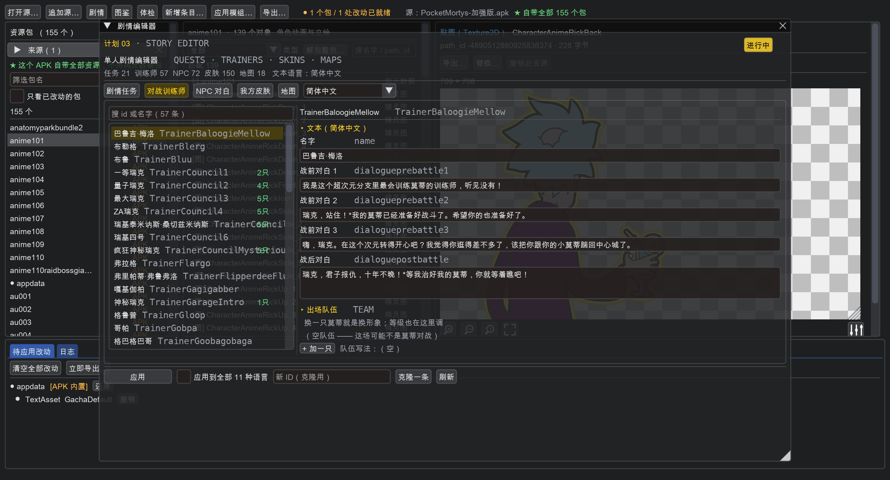

# 口蘑剧情编辑器

Pocket Mortys **单人剧情**编辑器 —— 改任务对白、对战训练师（含出场队伍）、
我方皮肤、地图。

> 从 [pm-modkit](https://github.com/b6x2yqyvsr-dotcom/pm-modkit) 里**独立出来**的。
> 它不依赖 pm-modkit，自己带着需要的那几个内核模块（`storykit/`）。



## 能改什么

| 板块 | 内容 |
|---|---|
| **剧情任务** | 任务名 / 给予者 / 描述 / 进行中对白 / 交不齐时的 / 完成时 / 交付后 —— **7 段全可改**，外加徽章需求、需要的物品、给予者形象 |
| **对战训练师** | 3 段战前对白 + 战后对白，**出场队伍编辑器**（换一只莫蒂就是换对方形象，等级可调） |
| **NPC 对白** | 72 个 NPC 的名字和对白 |
| **我方皮肤** | 150 个玩家形象，带**形象图预览**，可改显示名/形象资产/分类/价格/货币/议会等级需求 |
| **地图** | 18 张图的尺寸、材质主题、节点集、镜头边界、节点上限 |

实测（加强版）：任务 **21** / 训练师 **57** / NPC **72** / 皮肤 **150** / 地图 **18**，
文本 **11 种语言**。

## 为什么有两套数据

游戏把单机剧情拆在**两个地方**，改的时候两边都得动：

| 内容 | 数据表（`spdata`） | 文本（`text/<语言>`） |
|---|---|---|
| 剧情任务 | `QuestInfo` | `Quest` |
| 对战训练师 | `TrainerInfo` | `Trainer` |
| NPC | `NPCInfo` | `NPC` |
| 我方皮肤 | `PlayerAvatarInfo` | `PlayerAvatar` |
| 地图 | `WorldInfo` | `Dimensions` |

**只改一边没用**：把 `QuestInfo` 的奖励改了但 `text/Quest` 的对白没改，
游戏里就是「对白说给你三个芯片，实际给了一个」。这个工具两边一起写。

## 怎么用

### 图形界面

macOS / Linux：双击 `启动.command` / `bash 启动.sh`
Windows：双击 `启动.bat`

然后：

1. 点「**打开源…**」，选你的 `加强版.apk`（或者数据包 zip）
2. 点「**剧情**」
3. 左边挑一条，右边改，底下点「**应用**」
4. 点「**导出…**」选个目录

导出的是 **UnityCache 目录**，`adb push` 到
`/sdcard/Android/data/com.conspiracyrick.pocketmortys/files/UnityCache`
即生效，**不用重装 APK**。

### 命令行

```bash
# 列清单
python3 tools/cli.py list 加强版.apk --what quest
python3 tools/cli.py list 加强版.apk --what trainer

# 看一条的全文（对白 + 队伍 + 数据）
python3 tools/cli.py show 加强版.apk --what trainer --id TrainerCouncil1

# 改剧情文本，顺手导出
python3 tools/cli.py set 加强版.apk --what quest --id QuestPresident1 \
    --field name=给总统送Fleeb \
    --field activedialogue="小声点！没人知道我在这里。" \
    -o 导出目录

# 改训练师的出场队伍（换对方形象 + 调等级）
python3 tools/cli.py team 加强版.apk --trainer TrainerCouncil1 \
    --morties "MortyExoAlpha:30,MortySpooky:30" -o 导出目录

# 剧情体检
python3 tools/cli.py check 加强版.apk
```

## 剧情体检

`storykit.story.validate()` 会查剧情表和文本对不对得上：

```
✗ 1 个问题：
  ⚠ NPC 对白：1 个条目在 text/ZH_CN.NPC 里没有文本（例如 NPCMovingMortysJerry）
     —— 游戏里会显示成 ID
  ⚠ 训练师 TrainerXxx 的队伍里有不存在的莫蒂 MortyNope
```

这两个都会让游戏里显示成 ID 或者直接出错，改之前先跑一遍比较稳。

## 批量改文本

界面底部有「**应用到全部 11 种语言**」—— 勾上之后你填的中文会被写进全部语言。
自己做着玩这样最省事（别的语言反正也看不懂）；要给别人用就一种一种改。

命令行对应 `--all-langs`。

## 目录结构

```
storykit/          内核（自带，不依赖 pm-modkit）
  story.py         **单人剧情本体**
  session.py       一次编辑会话（打开源 / 改 / 出产物）
  source.py        APK / zip / 目录 → 容器 → bundle 引用
  bundle.py        单个 bundle 的读写（UnityFS）
  entries.py       条目操作（列莫蒂，队伍编辑器要用）
  effects.py       技能效果的两种编码互转
  fields.py        字段中英文对照
  paths.py         缓存目录名编解码
  sysenv.py        平台探测 / 找字体
app/main.py        图形界面
tools/cli.py       命令行
docs/              说明 + 截图
```

## 已知情况

- **`Dimensions` 段**的键是 `MP_WORLD_TITLE_1` 这种，和 `WorldInfo` 的 id 不是一套，
  所以「地图名」那个页签是按 `WorldInfo` 的条目走的，翻译名不一定对得上
- `NPCMovingMortysJerry` 在加强版的 `text/ZH_CN.NPC` 里没有文本（游戏自带的缺口）
- 手机端：Termux 或网页版暂未提供，目前是桌面 GUI + 命令行

## 许可

跟 pm-modkit 一致，仅供学习研究。
